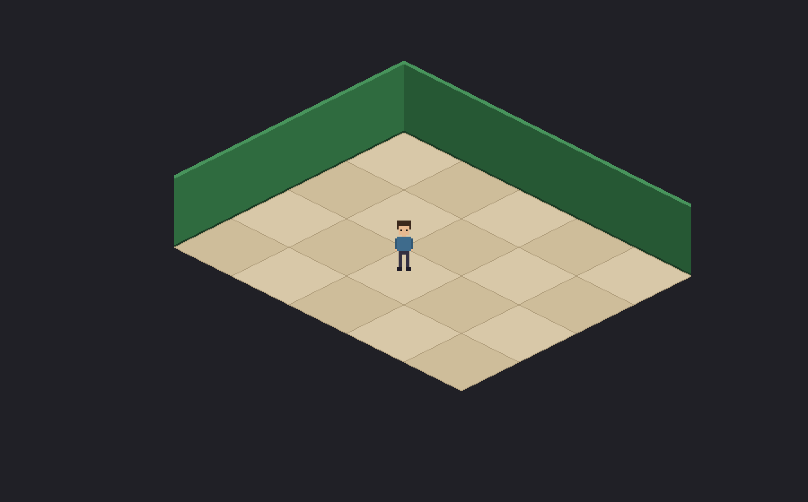

# DeetsLife



Interactive isometric pixel-art game. Ships as desktop builds (Windows + macOS).

> **The vision is being reworked.** It started as a walkable, gamified museum of the music
> of my life, organized by era, with jukeboxes as the interaction hubs. **Music is out of
> scope for now** and the new direction isn't settled. What holds: isometric pixel art,
> hand-drawn, in a walkable Godot world.

- **Direction & art:** Aditya (style, rooms, palette, caricature sprite).
- **Tech:** Godot 4 + GDScript (game) ← Libresprite (pixel art), Lightroom (photos).

See [docs/BUILD_PLAN.md](docs/BUILD_PLAN.md) for the roadmap,
[docs/PIXEL_ART_GUIDE.md](docs/PIXEL_ART_GUIDE.md) for the art workflow, and
[CLAUDE.md](CLAUDE.md) for working notes.

## Quick start

Install [Godot 4.4+](https://godotengine.org/download) (standard, not .NET), open the
`game/` folder, hit F5. WASD/arrows to walk. The dog follows you and sits when you stop.

## Tooling

There isn't any right now. `scripts/` held the iTunes enrichment, the 30s-preview
converter, the graybox art generator, and the dog frame-derivation tool. All four were
deleted once the art was final and music went out of scope.

Restore them if needed — nothing was lost:

```bash
git checkout cff5a68 -- scripts/     # the last commit that still had them
pip install -r scripts/requirements.txt
```

Most likely reason to: `derive_dog_frames.py` is the only thing that rebuilds
Happy's up idle and three walk strips from the two hand-drawn idles, so restore it
before redrawing `sprites/happy/idle_side.png` or `idle_down.png` (it predates the
per-character folders — fix its paths when restoring).

## License

[MIT](LICENSE).
